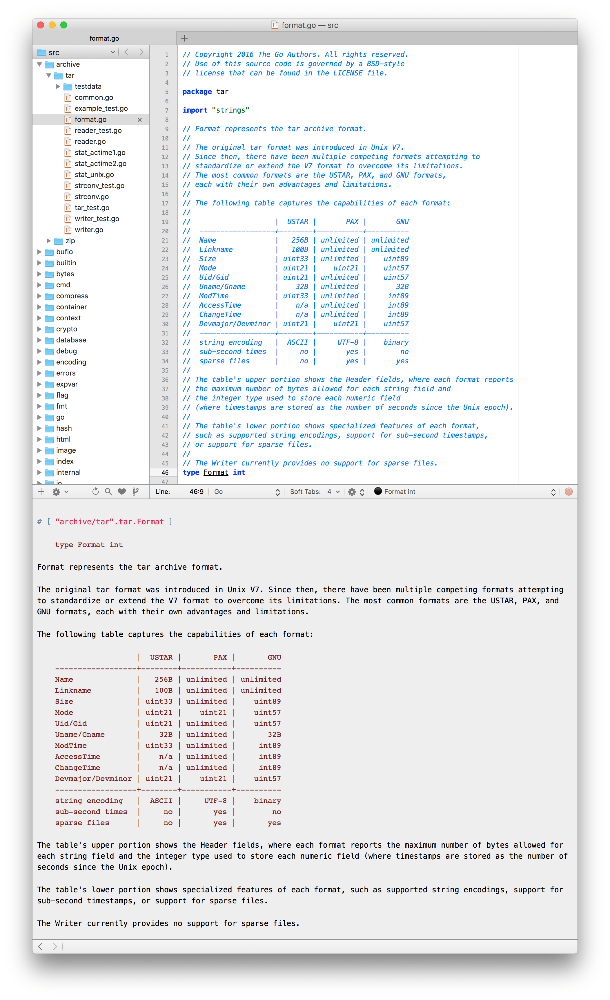

When writing code, an abundance of documentation is always welcome to guide future readers and contributors (which includes yourself). Documentation is so important in Go, that the language was designed with a standardized approach to writing good code comments that could be autogenerated into documentation (see the [Go team's official blog post on documentation](https://blog.golang.org/godoc-documenting-go-code)).

There are amazing tools that expose the power of Go documentation, such as [godoc](https://godoc.org/golang.org/x/tools/cmd/godoc). At the heart of godoc, is a simple package in the standard library called [doc](https://golang.org/pkg/go/doc). Doc contains a set of standard conventions for interacting with Go documentation. For example, the library includes a [standard formatter for how code comments should be formatted into HTML](). This includes formatting headers, code blocks, and paragraphs. The simplicity and standardized way of approaching the formatting of comments means that it is trivial for IDE's, text editors, and other developer tools to take advantage of displaying comments to the user in a consistent way.

Gomate, a side project of mine that provides Textmate extensions for working with Go code, utilizes the standardized rendering of HTML code for displaying symbol documentation:

*Note: the indented portion of the comment is rendered as monospaced HTML to preserve alignment*

The doc library also provides the notion of notes that annotate code in a structured fashion. Originally, notes first appeared as a mechanism for documenting bugs: `// BUG(r)`. Today, the notion of bug annotations are deprecated in the doc library in favor of a more general notation marking. I like to refer to these notes as `gonotes`. These notes take the form of a marker, a UID, and a body:

`MARKER(uid): note body`

The marker labels the category of comment. For example, you may have a comment related to describing a known bug, in which case the marker would be `BUG`. You could also have a marker for labeling a TODO item, where the marker would be `TODO`. In both cases, the UID could be a username responsible for following up on that issue. The note body contains any related details.

Here are a few examples of godoc notes from the Go standard library:

- [`TODO(mundaym): merge with case 24.`](https://github.com/golang/go/blob/9fa988547a778540eebfe0358536b7433efe6748/src/cmd/internal/obj/s390x/asmz.go#L3083)
- [`TODO(rogpeppe): re-enable this test in https://go-review.googlesource.com/#/c/5910/`](https://github.com/golang/go/blob/38c561cb2caa8019e44059e2be71c909ceef30a6/src/encoding/xml/marshal_test.go#L1768)
- [`TODO(rsc): Decide which tests are enabled by default.`](https://github.com/golang/go/blob/834d2244a0150d8ae29b587ed2193e81e552d601/src/cmd/go/internal/test/test.go#L505)
- [`BUG(brainman): This package is not implemented on Windows. As the syslog package is frozen, Windows users are encouraged to use a package outside of the standard library. For background, see https://golang.org/issue/1108.`](https://github.com/golang/go/blob/f9027d61ab48154e4cb29c50e356a3f462840e01/src/log/syslog/doc.go#L19)
- [`BUG(akumar): This package is not implemented on Plan 9.`](https://github.com/golang/go/blob/f9027d61ab48154e4cb29c50e356a3f462840e01/src/log/syslog/doc.go#L24)
- [`BUG(rsc): FieldByName and related functions consider struct field names to be equal if the names are equal, even if they are unexported names originating in different packages.`](https://github.com/golang/go/blob/997d7a1893ae15df1438c46487dd69903f16c57f/src/reflect/type.go#L211)

The godoc tool has some support for displaying notes. To show notes
